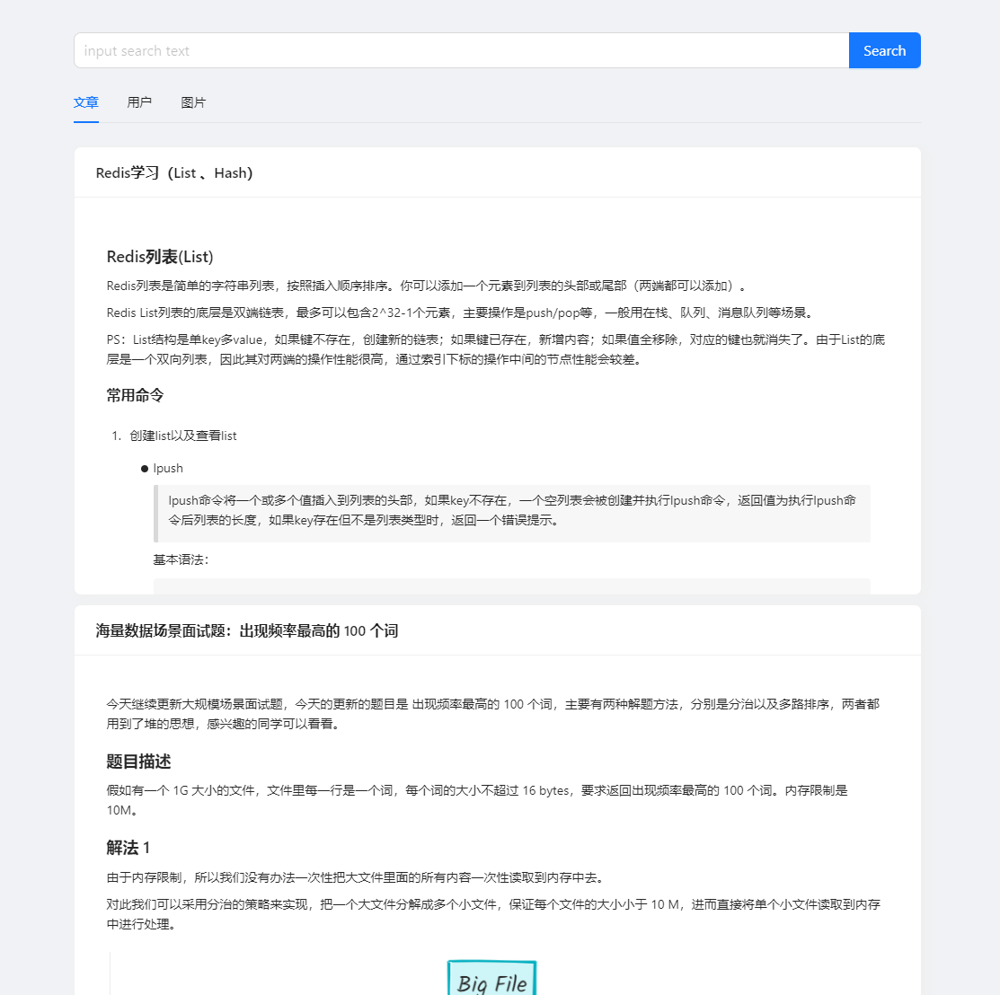
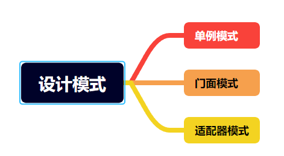

<h1 align="center">Aggregated Search - 聚合搜索</h1>

<strong>一个简易的聚合搜索系统框架</strong>

[toc]

## 项目介绍

​	基于 Spring Boot + Elastic Stack + Canal +  Vue 3 搭建的一站式信息聚合搜索平台框架。用户可在同一页面集中搜索出不同来源、不同类型的内容（比如文章、图片、用户、专栏、视频等），提升搜索体验。

​	基于此框架，可扩展更多的可能

## 技术选型

| 技术           | 说明                            | 官网                                                         |
| -------------- | ------------------------------- | ------------------------------------------------------------ |
| SpringBoot     | web开发必备框架                 | https://spring.io/projects/spring-boot                       |
| MyBatis        | ORM框架                         | http://www.mybatis.org/mybatis-3/zh/index.html               |
| MyBatisPlus    | 零sql，简化数据库操作，分页插件 | https://baomidou.com/                                        |
| Docker         | 应用容器引擎                    | https://www.docker.com                                       |
| Lombok         | 简化代码                        | https://projectlombok.org                                    |
| ElasticSearch  | 聚合搜索引擎                    | https://www.elastic.co/guide/en/elastic-stack/7.17/overview.html |
| Canal          | 基于 MySQL 数据库增量日志解析   | https://github.com/alibaba/canal                             |
| Vue3           | 前端流行开发框架                | [https://cn.vuejs.org](https://cn.vuejs.org/)                |
| TypeScript     | 让 JS 具备类型声明              | https://www.typescriptlang.org/                              |
| Ant Design Vue | Vue UI 库                       | https://2x.antdv.com/components/overview-cn                  |
|                |                                 |                                                              |

